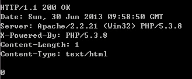

# Ajax笔记

- [一-Ajax请求流程](#一-ajax请求流程)
    - [1-如何创建xhr对象](#1-如何创建xhr对象)
    - [2-如何利用xhr发送请求](#2-如何利用xhr发送请求)
    - [3-如何获取请求返回的数据](#3-如何获取请求返回的数据)
    - [4-监听xhr状态](#4-监听xhr状态)
- [二-XHR详细探讨](#二-xhr详细探讨)
    - [1-属性](#1-属性)
    - [2-方法](#2-方法)
    - [3-应用](#3-应用)
    - [4-追加设置请求头信息](#4-追加设置请求头信息)
    - [5-返回值类型](#5-返回值类型)
- [三-JSONP跨域访问](#三-jsonp-跨域访问)
- [四-readystate详解](#四-readystate详解)
    - [1-属性](#1-属性)
    - [2-详解](#2-详解)
    - [3-实例测试](#3-实例测试)
- [五-Ajax异步原理](#五-ajax异步原理)

## 一-ajax请求流程

### 1-如何创建xhr对象

按标准，`new XMLHttpRequest()` 即可得到。

考虑低版本IE浏览器，可以`new window.ActiveXObject(Mircosoft.XMLHttp)`。新版本JQuery已经不支持IE6。

```javascript
function createXHR(){
	var xhr = null;
    if(window.XMLHttpRequest){
        xhr = new XMLHttpRequest();
        if(xhr.overrideMimeType){
            xhr.overrideMimeType("text/xml");
        }
    }else if(window.ActiveXObject){
        var activeName=["MSXML2.XMLHTTP","Microsoft.XMLHTTP"];
        for(var i=0;i<activeName.length;i++){
            try{
                xhr = new ActiveXObject(activeName[i]);
                break;
            }catch(e){
            }
        }
    }
    if(xhr == undefined || xhr == null){
        alert("XMLHttpRequest对象创建失败！！");
        return null;
    }else{
        return xhr;
    }
}
```

### 2-如何利用xhr发送请求

分析HTTP协议，请求需要明确这样几个因素。

1. 用什么方法来请求？GET、POST、PUT、DELETE、HEAD
2. 请求哪个资源？（URL）
3. 同步方式？（同步/异步）

### 3-如何获取请求返回的数据

XHR对象本身又一个属性`responseText`代表返回值

### 4-监听xhr状态

XHR对象在请求与响应的过程中，状态会不断变化（0-4）。绑定一个函数，监听XHR状态变化。

```javascript
function testAjax(){
	//1. 创建XHR
	var xhr = createXHR();
	//2. 打开连接
	xhr.open('GET','./url',false);
	//3. 发送请求
	xhr.send(null);
	//4. 如何获得返回信息?
	//如果是同步（false），发送请求后等待后台响应完成才继续执行，
	//如果是异步（true），发送请求后立即继续执行（会造成alert为空）
	alert(xhr.responseText);
	//5. 绑定状态变化监听函数
	xhr.onreadystatechange = function(){
		console.log(this.readyState);
		if(this.readyState == 4){
			console.log("请求完成");
		}
	}
}
```

## 二-xhr详细探讨

[XMLHttpRequest接口资料](https://developer.mozilla.org/zh-CN/docs/Web/API/XMLHttpRequest)

### 1-属性

|属性|说明| 
|:-------- | :--------| 
|responseText|服务器响应的主体信息，body信息。| 
|responseXML|对于大量的格式化文档，可以用XML来传输或交换数据，由后台程序把数据封装在XML文档中，js接收XML对象并解析内容。| 
|status|服务器返回的http状态码。200表示“成功”，404表示“未找到”，500表示“服务器内部错误”等。| 
|statusText|服务器返回状态码对应的文字描述。| 
|readyState|表示XMLHttpRequest对象的状态。| 
|onreadystatechange|请求状态改变的事件触发器（readyState变化时会调用这个属性上注册的javascript函数）。 | 

> html5新增属性`upload`等

### 2-方法

|方法|说明 |
|:-------- | :--------| 
|open(string method,string url,boolean asynch,String username,string password)|   指定和服务器端交互HTTP方法，URL地址，即其他请求信息；Method:表示http请求方法，一般使用"GET","POST".url：表示请求的服务器的地址；asynch：表示是否采用异步方法，true为异步，false为同步；后边两个可以不指定，username和password分别表示用户名和密码，提供http认证机制需要的用户名和密码。| 
|send(content)| 向服务器发出请求，如果采用异步方式，该方法会立即返回。content可以指定为null表示不发送数据，其内容可以是DOM对象，输入流或字符串。| 
|setRequestHeader(String header,String Value)|   设置HTTP请求中的指定头部header的值为value。此方法需在open方法以后调用，一般在post方式中使用。| 
|getAllResponseHeaders()|   返回包含Http的所有响应头信息，其中相应头包括Content-length,date,uri等内容。返回值是一个字符串，包含所有头信息，其中每个键名和键值用冒号分开，每一组键之间用CR和LF（回车加换行符）来分隔！| 
|getResponseHeader(String header)|   返回HTTP响应头中指定的键名header对应的值| 
|abort()|   停止当前http请求。对应的XMLHttpRequest对象会复位到未初始化的状态。| 

### 3-应用



```javascript
function testAjax(){
	var xhr = createXHR();
	xhr.open('GET','./url',false);
	xhr.send(null);
	//绑定状态变化监听函数
	xhr.onreadystatechange = function(){
		if(this.readyState == 4){
			console.log("请求完成");
			if(this.status == 200){
				console.log("请求成功");
				//获取响应中的信息
				console.log(this.statusText);
				console.log(this.getResponseHeader('Content-Type'));
				console.log(this.getResponseHeader('Content-Length'));
				console.log(this.responseText);
			}
		}
	}
}
```

### 4-追加设置请求头信息

有时需要设置请求头中的某些信息，eg：当发送数据不为空的时候，需要设置请求头的`contentType`属性为`"application/x-www-form-urlencoded; charset=UTF-8"`
```javascript
function testAjax(){
	var xhr = createXHR();
	xhr.open('GET','./url',false);
	
	//追加设置请求头中的某些信息
	xhr.setRequestHeader('Content-Type','application/x-www-form-urlencoded; charset=UTF-8');
	
	xhr.send("name=haha&password=123");
	xhr.onreadystatechange = function(){
		if(this.readyState == 4){
			console.log("请求完成");
			if(this.status == 200){
				console.log("请求成功");
			}
		}
	}
}
```

### 5-返回值类型

TEXT/XML/JSON

1. XML
`this.responseXML.getElementByTagName('list')[0];`

2. JSON
`var object = eval('('+this.responseText+')');`

## 三-JSONP-跨域访问

1. [JSONP简介](http://kb.cnblogs.com/page/139725/)

	1. 一个众所周知的问题，Ajax直接请求普通文件存在跨域无权限访问的问题，甭管你是静态页面、动态网页、web服务、WCF，只要是跨域请求，一律不准；
	2. 不过我们又发现，Web页面上调用js文件时则不受是否跨域的影响（不仅如此，我们还发现凡是拥有”src”这个属性的标签都拥有跨域的能力，比如 script、img、iframe）；
	3. 于是可以判断，当前阶段如果想通过纯web端（ActiveX控件、服务端代理、属于未来的HTML5之Websocket等方式不算）跨域访问数据就只有一种可能，那就是在远程服务器上设法把数据装进js格式的文件里，供客户端调用和进一步处理；
	4. 恰巧我们已经知道有一种叫做JSON的纯字符数据格式可以简洁的描述复杂数据，更妙的是JSON还被js原生支持，所以在客户端几乎可以随心所欲的处理这种格式的数据；
	5. 这样子解决方案就呼之欲出了，web客户端通过与调用脚本一模一样的方式，来调用跨域服务器上动态生成的js格式文件（一般以JSON为后缀），显而易见，服务器之所以要动态生成JSON文件，目的就在于把客户端需要的数据装入进去。
	6. 客户端在对JSON文件调用成功之后，也就获得了自己所需的数据，剩下的就是按照自己需求进行处理和展现了，这种获取远程数据的方式看起来非常像AJAX，但其实并不一样。
	7. 为了便于客户端使用数据，逐渐形成了一种非正式传输协议，人们把它称作JSONP，该协议的一个要点就是允许用户传递一个callback参数给服务端，然后服务端返回数据时会将这个callback参数作为函数名来包裹住JSON数据，这样客户端就可以随意定制自己的函数来自动处理返回数据了。
	
2. JSONP的具体实现
	1. 在jsonp.html页面定义一个函数，然后在远程remote.js中传入数据进行调用。
	
		```html
		//jsonp.html页面代码
		<!DOCTYPE html>
		<html>
		<head>
			<title>测试JSONP</title>
			<meta http-equiv="Content-Type" content="text/html; charset=utf-8" />
		    <meta http-equiv="X-UA-Compatible" content="IE=edge,chrome=1" />
		    <script type="text/javascript">
			    var localHandler = function(data){
			        alert('我是本地函数，可以跨域调用remote.js文件，远程js带来的数据是：' + data.result);
			    };
		    </script>
		    <script type="text/javascript" src="testJsonp.js"></script>
		</head>
		<body>
		</body>
		</html>
		```
		
		```html
        //jsonp.js页面代码
        localHandler({"result":"我是远程js带来的数据"});
		```
		
	2. 动态调用接口。
	
		```html
		<!DOCTYPE html>
		<html>
		<head>
			<title>测试JSONP</title>
			<meta http-equiv="Content-Type" content="text/html; charset=utf-8" />
		    <meta http-equiv="X-UA-Compatible" content="IE=edge,chrome=1" />
		    
		    <script type="text/javascript">
		    // 得到查询结果后的回调函数
		    var render= function(data){
		        console.log(data);
		    };
		    // 提供jsonp服务的url地址（不管是什么类型的地址，最终生成的返回值都是一段javascript代码）
		    var url = "https://api.douban.com/v2/book/search?q=movie&callback=render";
		    // 创建script标签，设置其属性
		    var script = document.createElement('script');
		    script.setAttribute('src', url);
		    // 把script标签加入head，此时调用开始
		    document.getElementsByTagName('head')[0].appendChild(script);
		    </script>

		</head>
		<body>
		
		</body>
		</html>
		```

## 四-readystate详解

### 1-属性
|readystate | state |   description |
|:-------- | :--------| :------|
|0|UNSENT|  Client has been created. open() not called yet.|
|1|OPENED	|  open() has been called.|
|2|HEADERS_RECEIVED	|  send() has been called, and headers and status are available.|
|3|LOADING	|  	Downloading; responseText holds partial data.|
|4|DONE	|  The operation is complete.|

`readyState`属性的值

|值|状态|描述|
|----|----|----|
|0|UNSENT (未打开)|open()方法还未被调用.|
|1|OPENED  (未发送)|send()方法还未被调用.|
|2|HEADERS_RECEIVED (已获取响应头)|send()方法已经被调用, 响应头和响应状态已经返回.|
|3|LOADING (正在下载响应体)|响应体下载中; responseText中已经获取了部分数据.|
|4|DONE (请求完成)|整个请求过程已经完毕.|

### 2-详解

1. UNSENT
    
    The XMLHttpRequest client has been created, but the open() method hasn't been called yet.

2. OPENED
    
    open() method has been invoked. During this state, the request headers can be set using the setRequestHeader() method and the send() method can be called which will initiate the fetch.

3. HEADERS_RECEIVED
    
    send() has been called and the response headers have been received.

4. LOADING

    Response's body is being received. If responseType is "text" or empty string, responseText will have the partial text response as it loads.

5. DONE

    The fetch operation is complete. This could mean that either the data transfer has been completed successfully or failed.

### 3-实例测试

```javascript
var xhr = new XMLHttpRequest();
console.log('UNSENT', xhr.readyState); // readyState will be 0

xhr.open('GET', '/api', true);
console.log('OPENED', xhr.readyState); // readyState will be 1

xhr.onprogress = function () {
    console.log('LOADING', xhr.readyState); // readyState will be 3
};

xhr.onload = function () {
    console.log('DONE', xhr.readyState); // readyState will be 4
};

xhr.send(null);
```

## 五-Ajax异步原理

[javasript异步编程](Js%E5%BC%82%E6%AD%A5%E7%BC%96%E7%A8%8B%E2%80%93%E5%9B%9E%E8%B0%83%E5%87%BD%E6%95%B0.md)

