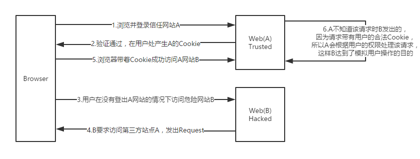

# CSRF攻击

CSRF（Cross-site request forgery），中文名称：跨站请求伪造。

## 图解CSRF

首先要了解`session`是如何工作的

小问题：如果我把浏览器的`cookie`禁用了，大家认为`session`还能正常工作吗？

答案是否定的。

一个简单的例子帮助大家理解session。

比如我买了一张高尔夫俱乐部的会员卡，俱乐部给了我一张带有卡号的会员卡。我能享受哪些权利以及我的个人资料都是保存在高尔夫俱乐部的数据库里的。
我每次去高尔夫俱乐部只需要出示这张高级会员卡，俱乐部就知道我是谁了，并且为我服务了。

这里我们的高级会员卡卡号 = 保存在`cookie`里的`sessionId`；
而我的高级会员卡权利和个人信息就是服务端的`session`对象了。

我们知道`http`请求是无状态的，也就是说每次`http`请求都是独立的无关之前的操作的，每次`http`请求都会将本域下的所有`cookie`作为`http`请求头的一部分发送给服务端，
所以服务端就根据请求中的`cookie`存放的`sessionId`去`session`对象中找到该会员资料了。

CSRF就是通过获取在浏览器上保存的`Cookie`信息，顶替用户身份，模拟用户操作。

## CSRF实例

`http://bank.example/withdraw?account=bob&amount=1000000&for=bob2`可以使Bob把1000000的存款转到Bob2的账号下。

通常情况下，该请求发送到网站后，服务器会先验证该请求是否来自一个合法的`session`，并且该`session`的用户已经成功登录。

黑客可以自己发送一个请求给银行：`http://bank.example/withdraw?account=bob&amount=1000000&for=Mallory`。
但是这个请求来自 `Mallory` 而非 `Bob`，他不能通过安全认证，因此该请求不会起作用。

黑客自己做一个网站，在网站中放入如下代码：`src="http://bank.example/withdraw?account=bob&amount=1000000&for=Mallory"`，并且通过广告等诱使 Bob 来访问他的网站。当 Bob 访问该网站时，上述 `url` 就会从 Bob 的浏览器发向银行，而这个请求会附带 Bob 浏览器中的 `cookie` 一起发向银行服务器。

如果 Bob 当时恰巧刚访问他的银行后不久，他的浏览器与银行网站之间的 `session` 尚未过期，浏览器的 `cookie` 之中含有 Bob 的认证信息。

然后GG。

## CSRF攻击对象

在讨论如何抵御 CSRF 之前，先要明确 CSRF 攻击的对象，也就是要保护的对象。

从以上的例子可知，CSRF 攻击是黑客借助受害者的 `cookie` 骗取服务器的信任，但是黑客并不能拿到 `cookie`。
另外，对于服务器返回的结果，由于浏览器同源策略的限制，黑客也无法进行解析。
因此，黑客无法从返回的结果中得到任何东西，他所能做的就是给服务器发送请求，以执行请求中所描述的命令，在服务器端直接改变数据的值，而非窃取服务器中的数据。
所以，我们要保护的对象是那些可以直接产生数据改变的服务，而对于读取数据的服务，则不需要进行 CSRF 的保护。
比如银行系统中转账的请求会直接改变账户的金额，会遭到 CSRF 攻击，需要保护。
而查询余额是对金额的读取操作，不会改变数据，CSRF 攻击无法解析服务器返回的结果，无需保护。

## 防御CSRF的几种策略

目前防御 CSRF 攻击主要有三种策略

- 验证 `HTTP Referer` 字段；
- 在请求地址中添加 `token` 并验证；
- 在 `HTTP` 头中自定义属性并验证。

### 验证HTTP Referer

根据 HTTP 协议，在 HTTP 头中有一个字段叫 `Referer`，它记录了该 HTTP 请求的来源地址。
在通常情况下，访问一个安全受限页面的请求来自于同一个网站，比如需要访问 `http://bank.example/withdraw?account=bob&amount=1000000&for=Mallory`，用户必须先登录`bank.example`，然后通过点击页面上的按钮来触发转账事件。
这时，该转帐请求的 `Referer` 值就会是转账按钮所在的页面的 `URL`，通常是以 `bank.example` 域名开头的地址。
而如果黑客要对银行网站实施 CSRF 攻击，他只能在他自己的网站构造请求，当用户通过黑客的网站发送请求到银行时，该请求的 `Referer` 是指向黑客自己的网站。
因此，要防御 CSRF 攻击，银行网站只需要对于每一个转账请求验证其 `Referer` 值，如果是以 `bank.example` 开头的域名，则说明该请求是来自银行网站自己的请求，是合法的。
如果 `Referer` 是其他网站的话，则有可能是黑客的 CSRF 攻击，拒绝该请求。

这种方法的显而易见的好处就是简单易行，网站的普通开发人员不需要操心 CSRF 的漏洞，只需要在最后给所有安全敏感的请求统一增加一个拦截器来检查 `Referer` 的值就可以。特别是对于当前现有的系统，不需要改变当前系统的任何已有代码和逻辑，没有风险，非常便捷。

然而，这种方法并非万无一失。`Referer` 的值是由浏览器提供的，虽然 HTTP 协议上有明确的要求，但是每个浏览器对于 `Referer` 的具体实现可能有差别，并不能保证浏览器自身没有安全漏洞。
使用验证 `Referer` 值的方法，就是把安全性都依赖于第三方（即浏览器）来保障，从理论上来讲，这样并不安全。
事实上，对于某些浏览器，比如 IE6 或 FF2，目前已经有一些方法可以篡改 `Referer` 值。如果 `bank.example` 网站支持 IE6 浏览器，黑客完全可以把用户浏览器的 `Referer` 值设为以 `bank.example` 域名开头的地址，这样就可以通过验证，从而进行 CSRF 攻击。
即便是使用最新的浏览器，黑客无法篡改 `Referer` 值，这种方法仍然有问题。因为 `Referer` 值会记录下用户的访问来源，有些用户认为这样会侵犯到他们自己的隐私权，
特别是有些组织担心 `Referer` 值会把组织内网中的某些信息泄露到外网中。因此，用户自己可以设置浏览器使其在发送请求时不再提供 `Referer`。当他们正常访问银行网站时，网站会因为请求没有 `Referer` 值而认为是 CSRF 攻击，拒绝合法用户的访问。

### 在请求地址中添加token并验证

CSRF 攻击之所以能够成功，是因为黑客可以完全伪造用户的请求，该请求中所有的用户验证信息都是存在于 `cookie` 中，因此黑客可以在不知道这些验证信息的情况下直接利用用户自己的 `cookie` 来通过安全验证。
要抵御 CSRF，关键在于在请求中放入黑客所不能伪造的信息，并且该信息不存在于 `cookie` 之中。
可以在 HTTP 请求中以参数的形式加入一个随机产生的 `token`，并在服务器端建立一个拦截器来验证这个 `token`，如果请求中没有 `token` 或者 `token` 内容不正确，则认为可能是 CSRF 攻击而拒绝该请求。

这种方法要比检查 `Referer` 要安全一些，`token` 可以在用户登陆后产生并放于 `session` 之中，然后在每次请求时把 `token` 从 `session` 中拿出，与请求中的 `token` 进行比对，但这种方法的难点在于如何把 `token` 以参数的形式加入请求。
对于 `GET` 请求，`token` 将附在请求地址之后，这样 `URL` 就变成 `http://url?csrftoken=tokenvalue`。
而对于 `POST` 请求来说，要在 `form` 的最后加上 `<input type=”hidden” name=”csrftoken” value=”tokenvalue”/>`，这样就把 `token` 以参数的形式加入请求了。但是，在一个网站中，可以接受请求的地方非常多，要对于每一个请求都加上 `token` 是很麻烦的，并且很容易漏掉。

### 在 HTTP 头中自定义属性并验证

这种方法也是使用 `token` 并进行验证，和上一种方法不同的是，这里并不是把 `token` 以参数的形式置于 HTTP 请求之中，而是把它放到 HTTP 头中自定义的属性里。
通过 `XMLHttpRequest` 这个类，可以一次性给所有该类请求加上 `csrfToken` 这个 HTTP 头属性，并把 `token` 值放入其中。
这样解决了上种方法在请求中加入 `token` 的不便，同时，通过 `XMLHttpRequest` 请求的地址不会被记录到浏览器的地址栏，也不用担心 `token` 会透过 `Referer` 泄露到其他网站中去。

然而这种方法的局限性非常大。`XMLHttpRequest` 请求通常用于 `Ajax` 方法中对于页面局部的异步刷新，并非所有的请求都适合用这个类来发起，
而且通过该类请求得到的页面不能被浏览器所记录下，从而进行前进，后退，刷新，收藏等操作，给用户带来不便。
另外，对于没有进行 CSRF 防护的遗留系统来说，要采用这种方法来进行防护，要把所有请求都改为 `XMLHttpRequest` 请求，这样几乎是要重写整个网站，这代价无疑是不能接受的。

参考：

[1:CSRF攻击的应对之道](http://www.ibm.com/developerworks/cn/web/1102_niugang_csrf/index.html)