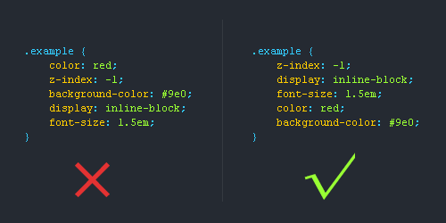
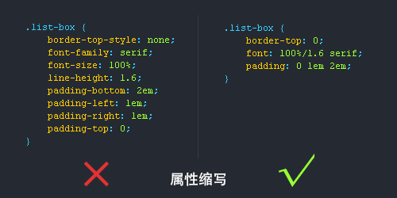
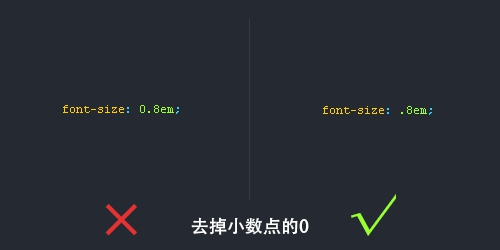
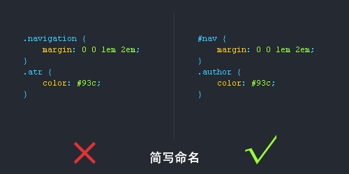
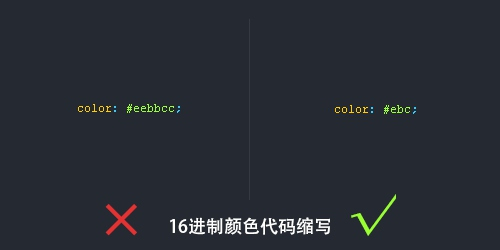
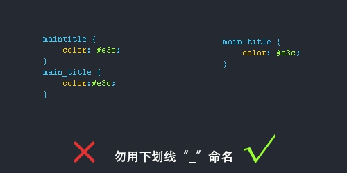
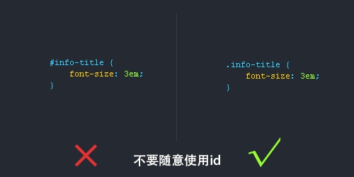
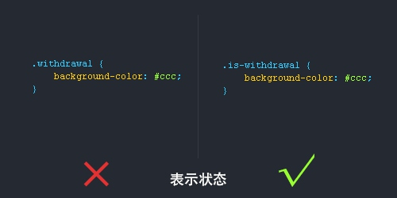

#CSS书写规范

##CSS书写顺序

1. 位置属性(position, top, right, z-index, display, float等)
2. 大小(width, height, padding, margin)
3. 文字系列(font, line-height, letter-spacing, color- text-align等)
4. 背景(background, border等)
5. 其他(animation, transition等)



##使用CSS缩写属性
CSS有些属性是可以缩写的，比如padding,margin,font等等，这样精简代码同时又能提高用户的阅读体验。



去掉小数点前的“0”。



简写命名。

很多用户都喜欢简写类名，但前提是要让人看懂你的命名才能简写哦!



16进制颜色代码缩写。

有些颜色代码是可以缩写的，我们就尽量缩写吧，提高用户体验为主。



连字符CSS选择器命名规范。

1. 长名称或词组可以使用中横线来为选择器命名。
2. 不建议使用`下划线`来命名CSS选择器，为什么呢?
	- 输入的时候少按一个shift键;
	- 浏览器兼容问题 (比如使用_tips的选择器命名，在IE6是无效的)
	- 能良好区分JavaScript变量命名(JS变量命名是用`下划线`)



不要随意使用Id。

id在JS是唯一的，不能多次使用，而使用class类选择器却可以重复使用，另外id的优先级优先于class，所以id应该按需使用，而不能滥用。　



为选择器添加状态前缀。

有时候可以给选择器添加一个表示状态的前缀，让语义更明了，比如下图是添加了“.is-”前缀。



##常用的CSS命名

- 头：header
- 内容：content/container
- 尾：footer
- 导航：nav
- 侧栏：sidebar
- 栏目：column
- 页面外围控制整体佈局宽度：wrapper
- 左右中：left right center
- 登录条：loginbar
- 标志：logo
- 广告：banner
- 页面主体：main
- 热点：hot
- 新闻：news
- 下载：download
- 子导航：subnav
- 菜单：menu
- 子菜单：submenu
- 搜索：search
- 友情链接：friendlink
- 页脚：footer
- 版权：copyright
- 滚动：scroll
- 内容：content
- 标签：tags
- 文章列表：list
- 提示信息：msg
- 小技巧：tips
- 栏目标题：title
- 加入：joinus
- 指南：guide
- 服务：service
- 注册：regsiter
- 状态：status
- 投票：vote
- 合作伙伴：partner

###注释的写法:
```
/* Header */
内容区
/* End Header */
```

###CSS样式表文件命名

- 主要的 master.css
- 模块 module.css
- 基本共用 base.css
- 布局、版面 layout.css
- 主题 themes.css
- 专栏 columns.css
- 文字 font.css
- 表单 forms.css
- 补丁 mend.css
- 打印 print.css