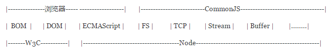

CommonJS、RequireJS(AMD)、SeaJS(CMD)解析

- [CommonJS](#commonjs)
- [AMD](#amd)
- [CMD](#cmd)
- [AMD的CommonJS wrapping](#amd的commonjswrapping)

## CommonJS

`CommonJS`就是为JS的表现来制定规范，因为js没有模块的功能所以`CommonJS`应运而生，它希望js可以在任何地方运行，不只是浏览器中。

Node，CommonJS，浏览器甚至是W3C之间的关系：



`CommonJ`S定义的模块分为:`{模块引用(require)} {模块定义(exports)} {模块标识(module)}`

- `require()`用来引入外部模块；
- `exports`对象用于导出当前模块的方法或变量，唯一的导出口；
- `module`对象就代表模块本身。

```javascript
//sum.js
exports.sum = function(){};

//calculate.js
var math = require('sum');
function add(n) {
    return math.sum(val,n);
}
```

## AMD

`CommonJS`是主要为了JS在后端的表现制定的，他是不适合前端的，为什么这么说呢？

这需要分析一下浏览器端的js和服务器端js都主要做了哪些事，有什么不同了：

|服务器端JS|浏览器端JS|
|:---:|:---:|
|相同的代码需要多次执行|代码需要从一个服务器端分发到多个客户端执行|
|CPU和内存资源是瓶颈|带宽是瓶颈|
|加载时从磁盘中加载|加载时需要通过网络加载|

于是乎，AMD((Asynchromous Module Definition)出现了，它就主要为前端JS的表现制定规范。

AMD异步加载模块。它的模块支持对象 函数 构造器 字符串 JSON等各种类型的模块。

AMD接口：`define(id?,dependencies?,factory);`

它要在声明模块的时候制定所有的依赖(dep)，并且还要当做形参传到factory中，像这样：

```javascript
//通过数组引入依赖 ，回调函数通过形参传入依赖 
define(['someModule1', 'someModule2'], function (someModule1, someModule2) { 

    function foo () { 
        /// something
        someModule1.test(); 
        someModule2.test();
    } 

    return {foo: foo} 
});
```

AMD规范允许输出模块兼容`CommonJS`规范，这时`define`方法如下： 

```javascript
define(function (require, exports, module) { 
     
    var reqModule = require("./someModule"); 
    requModule.test(); 
     
    exports.test = function () { 
        //someing 
    } 
}); 
```

## CMD

CMD是`SeaJS`在推广过程中对模块定义的规范化产出 

CMD和AMD的区别有以下几点：

>AMD和CMD的异同
>链接：https://www.zhihu.com/question/20351507/answer/14859415
>作者：玉伯

1. 对于依赖的模块AMD是提前执行，CMD是延迟执行。不过RequireJS从2.0开始，也改成可以延迟执行（根据写法不同，处理方式不通过）。

2. CMD推崇依赖就近，AMD推崇依赖前置。 

3. AMD的`api`默认是一个当多个用，CMD严格的区分推崇职责单一。例如：AMD里`require`分全局的和局部的。CMD里面没有全局的`require`,提供`seajs.use()`来实现模块系统的加载启动。CMD里每个API都简单纯粹。
```javascript
// AMD 
define(['./a','./b'], function (a, b) { 
    //依赖一开始就写好 
    a.test(); 
    b.test(); 
}); 

// CMD 
define(function (require, exports, module) { 
    //依赖可以就近书写 
    var a = require('./a'); 
    a.test(); 

    //软依赖 
    if (status) { 
        var b = require('./b'); 
        b.test(); 
    } 
}); 
```

虽然 AMD也支持CMD写法，但依赖前置是官方文档的默认模块定义写法。

## AMD的CommonJS wrapping

>AMD 的 CommonJS wrapping
>https://imququ.com/post/amd-simplified-commonjs-wrapping.html
>作者：Jerry Qu

结论是，CommonJS Wrapper 只是书写上兼容了 CommonJS 的写法，模块运行逻辑并不会改变。