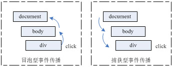
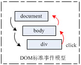

##什么是事件？

**事件(Event)**是JavaScript应用跳动的心脏 ，也是把所有东西粘在一起的胶水。当我们与浏览器中 Web 页面进行某些类型的交互时，事件就发生了。事件可能是用户在某些内容上的点击、鼠标经过某个特定元素或按下键盘上的某些按键。事件还可能是 Web 浏览器中发生的事情，比如说某个 Web 页面加载完成，或者是用户滚动窗口或改变窗口大小。
通过使用 JavaScript ，你可以监听特定事件的发生，并规定让某些事件发生以对这些事件做出响应。

##事件的发展

在漫长的演变史，我们已经告别了内嵌式的事件处理方式（直接将事件处理器放在 HTML 元素之内来使用）。今天的事件，它已是DOM的重要组成部分，遗憾的是， IE继续保留它最早在IE4.0中实现的事件模型，以后的IE版本中也没有做太大的改变，这也就是说IE还是使用的是一种专有的事件模型（冒泡型）,而其它的主流浏览器直到DOM 级别 3 规定定案后，才陆陆续续支持DOM标准的事件处理模型 — **捕获型与冒泡型**。

历史原因是：W3C 规范 在DOM 级别 1中并没有定义任何的事件，直到发布于 2000 年 11 月 的DOM 级别 2 才定义了一小部分子集，DOM 级别 2中已经提供了提供了一种更详细的更细致的方式以控制 Web 页面中的事件，最后，完整的事件是在2004年 DOM 级别 3的规定中才最终定案。因为IE4是1995推出的并已实现了自己的事件模型（冒泡型），当时根本就没有DOM标准，不过在以后的DOM标准规范过程中已经把IE的事件模型吸收到了其中。

目前除IE浏览器外，其它主流的Firefox, Opera, Safari都支持标准的DOM事件处理模型。IE仍然使用自己专有的事件模型，即冒泡型，它事件模型的一部份被DOM标准采用，这点对于开发者来说也是有好处的，只有使用

DOM标准，IE都共有的事件处理方式才能有效的跨浏览器。

##DOM事件流

DOM(文档对象模型)结构是一个树型结构，当一个HTML元素产生一个事件时，该事件会在元素结点与根节点之间按特定的顺序传播，路径所经过的节点都会收到该事件，这个传播过程可称为DOM事件流。

事件顺序有两种类型：事件捕捉和事件冒泡。

###冒泡型事件(Event Bubbling)

这是IE浏览器对事件模型的实现，也是最容易理解的。冒泡，顾名思义，事件像个水中的气泡一样一直往上冒，直到顶端。从DOM树型结构上理解，就是事件由叶子节点沿祖先结点一直向上传递直到根节点；从浏览器界面视图HTML元素排列层次上理解就是事件由具有从属关系的最确定的目标元素一直传递到最不确定的目标元素.冒泡技术.冒泡型事件的基本思想,事件按照从特定的事件目标开始到最不确定的事件目标.

###捕获型事件(Event Capturing)

Netscape 的实现，它与冒泡型刚好相反，由DOM树最顶层元素一直到最精确的元素，这个事件模型对于开发者来说有点费解，因为直观上的理解应该如同冒泡型，事件传递应该由最确定的元素，即事件产生元素开始。



###DOM标准的事件模型

我们已经对上面两个不同的事件模型进行了解释和对比。DOM标准同时支持两种事件模型，即捕获型事件与冒泡型事件，但是，捕获型事件先发生。两种事件流都会触发DOM中的所有对象，从document对象开始，也在document对象结束（大部分兼容标准的浏览器会继续将事件是捕捉/冒泡延续到window对象）。



如图：首先是捕获式传递事件，接着是冒泡式传递，所以，如果一个处理函数既注册了捕获型事件的监听，又注册冒泡型事件监听，那么在DOM事件模型中它就会被调用两次。

DOM标准的事件模型最独特的性质是,文本节点也会触发事件(在IE不会)。


##事件传送

显然，如果为一个超链接添加了click事件监听器，那么当该链接被点击时该事件监听器就会被执行。但如果把该事件监听器指派给了包含该链接的p元素或者位于DOM树顶端的document节点，那么点击该链接也同样会触发该事件监听器。这是因为事件不仅仅对触发的目标元素产生影响，它们还会对沿着DOM结构的所有元素产生影响。这就是大家所熟悉的事件转送。

W3C事件模型中明确地指出了事件转送的原理。事件传送可以分为3个阶段。


如图：标准的事件转送模式
1. 在事件捕捉（Capturing）阶段，事件将沿着DOM树向下转送，目标节点的每一个祖先节点，直至目标节点。例如，若用户单击了一个超链接，则该单击事件将从document节点转送到html元素，body元素以及包含该链接的p元素。
在此过程中，浏览器都会检测针对该事件的捕捉事件监听器，并且运行这件事件监听器。
2. 在目标（target）阶段，浏览器在查找到已经指定给目标事件的事件监听器之后，就会运行 该事件监听器。目标节点就是触发事件的DOM节点。例如，如果用户单击一个超链接，那么该链接就是目标节点（此时的目标节点实际上是超链接内的文本节点）。
3. 在冒泡（Bubbling）阶段，事件将沿着DOM树向上转送，再次逐个访问目标元素的祖先节点到document节点。该过程中的每一步。浏览器都将检测那些不是捕捉事件监听器的事件监听器，并执行它们。

>并非所有的事件都会经过冒泡阶段的。
>所有的事件都要经过捕捉阶段和目标阶段，但是有些事件会跳过冒泡阶段。例如，让元素获得输入焦点的focus事件以及失去输入焦点的blur事件就都不会冒泡。

##事件句柄和事件监听器

###事件句柄

事件句柄（又称事件处理函数，DOM称之为事件监听函数），用于响应某个事件而调用的函数称为事件处理函数。

每一个事件均对应一个事件句柄，在程序执行时，将相应的函数或语句指定给事件句柄，则在该事件发生时，浏览器便执行指定的函数或语句，从而实现网页内容与用户操作的交互。当浏览器检测到某事件发生时，便查找该事件对应的事件句柄有没有被赋值，如果有，则执行该事件句柄。

我们认为响应点击事件的函数是onclick事件处理函数。以前，事件处理函数有两种分配方式：在JavaScript中或者在HTML中。

如果在JavaScript 中分配事件处理函数， 则需要首先获得要处理的对象的一引用，然后将函数赋值给对应的事件处理函数属性，请看一个简单的例子：

```
var link=document.getElementById("mylink");
link.onclick=function(){
	alert("I was clicked !");
}; 
```

不过事件处理函数只有在元素载入完成之后才能将事件句柄赋给元素，不然会有异常。

如果在HTML中分配事件句柄的话，则直接通过HTML属性来设置事件处理函数就行了，并在其中包含合适的脚本作为特性值就可以了，例如：

```
<a href="/" onclick="JavaScript code here">......</a>
```

这种JavaScript 代码和通过HTML的style属性直接将CSS属性赋给元素类似。这样会代码看起来一团糟，也违背了将实现动态行为的代码与显示文档静态内容的代码相分离的原则。从1998年开始，这种写法就过时了。

这种传统的事件绑定技术，优缺点是显然的：
- 简单方便，在HTML中直接书写处理函数的代码块，在JS中给元素对应事件属性赋值即可。
- IE与DOM标准都支持的一种方法，它在IE与DOM标准中都是在事件冒泡过程中被调用的。
- 可以在处理函数块内直接用this引用注册事件的元素，this引用的是当前元素。
- 要给元素注册多个监听器，就不能用这方法了。

###事件监听器

除了前面已经介绍的简单事件句柄之外，现在大多数浏览器都内置了一些更高级的事件处理方式，即，事件监听器，这种处理方式就不受一个元素只能绑定一个事件句柄的限制。

我们已经知道了事件句柄与事件监听器的最大不同之处是使用事件句柄时一次只能插接一个事件句柄，但对于事件监听器，一次可以插接多个。

####IE下的事件监听器

IE提供的却是一种自有的，完全不同的甚至存在BUG的事件监听器，因此如果要让脚本在本浏览器中正常运行的话，就必须使用IE所支持的事件监听器。另外，Safari 浏览器中的事件监听器有时也存在一点不同。

在IE中，每个元素和window对象都有两个方法：`attachEvent`方法和`detachEvent`方法。 

```
element.attachEvent("onevent",eventListener);
```

此方法的意思是在IE中要想给一个元素的事件附加事件处理函数，必须调用`attachEvent`方法才能创建一个事件监听器。

`attachEvent`方法允许外界注册该元素多个事件监听器。
`attachEvent`接受两个参数。第一个参数是事件类型名，第二个参数`eventListener`是回调处理函数。这里得说明一下，有个经常会出错的地方，IE下利用attachEvent注册的处理函数调用时this指向不再是先前注册事件的元素，这时的this为window对象。还有一点是此方法的事件类型名称必须加上一个”on”的前缀（如onclick）。 

```
element.attachEvent("onevent",eventListener);
```

要想移除先前元素注册的事件监听器,可以使用`detachEvent`方法进行删除，参数相同。

####DOM标准下的事件监听器

在支持W3C标准事件监听器的浏览器中，对每个支持事件的对象都可以使用`addEventListener`方法。该方法既支持注册冒泡型事件处理，又支持捕获型事件处理。所以与IE浏览器中注册元素事件监听器方式有所不同的。

```
//标准语法 
element.addEventListener('event', eventListener, useCapture);
//默认
element.addEventListener('event', eventListener, false);
```

`addEventListener`方法接受三个参数。
第一个参数是事件类型名，值得注意的是，这里事件类型名称与IE的不同，事件类型名是没’on’开头的;
第二个参数`eventListener`是回调处理函数（即监听器函数）;
第三个参数注明该处理回调函数是在事件传递过程中的捕获阶段被调用还是冒泡阶段被调用 ，通常此参数通常会设置为`false`（为false时是冒泡）,那么，如果将其值设置为`true`，那就创建一个捕捉事件监听器。

移除已注册的事件监听器调用element的`removeEventListener`方法即可，参数相同。

通过`addEventListener`方法添加的事件处理函数，必须使用`removeEventListener`方法才能删除，而且要求参数与添加事件处理函数时`addEventListener`方法的参数完全一致（包括`useCapture`参数），否则将不能成功删除事件处理函数。

####跨浏览器的注册与移除元素事件监听器方案

我们现在已经知道，对于支持`addEventListener`方法的浏览器，只要需要事件监听器脚本就都需要调用`addEventListener`方法；而对于不支持该方法的IE浏览器，使用事件监听器时则需要调用`attachEvent`方法。要确保浏览器使用正确的方法其实并不困难，只需要通过一个`if-else`语句来检测当前浏览器中是否存在`addEventListener`方法或`attachEvent`方法即可。
这样的方式就可以实现一个跨浏览器的注册与移除元素事件监听器方案:
 
```
var EventUtil = {
	//注册
	addHandler: function(element, type, handler){
		if (element.addEventListener){
			element.addEventListener(type, handler, false);
		} else if (element.attachEvent){
			element.attachEvent("on" + type, handler);
		} else {
			element["on" + type] = handler;
		}
	},
	//移除注册
	removeHandler: function(element, type, handler){
		if (element.removeEventListener){
			element.removeEventListener(type, handler, false);
		} else if (element.detachEvent){
			element.detachEvent("on" + type, handler);
		} else {
			element["on" + type] = null;
		}
	}             
}; 
```
 
##事件对象引用

为了更好的处理事件，你可以根据所发生的事件的特定属性来采取不同的操作。

如事件模型一样，IE 和其他浏览器处理方法不同：IE 使用一个叫做 event 的全局事件对象来处理对象（它可以在全局变量window.event中找到），而其它所有浏览器采用的 W3C 推荐的方式，则使用独立的包含事件对象的参数传递。

跨浏览器实现这样的功能时，最常见的问题就是**获取事件本身的引用及获取该事件的目标元素的引用**。

下面这段代码就为你解决了这个问题：

```
var EventUtil ={
	getEvent: function(event){
		return event ? event : window.event;
	},
	getTarget: function(event){
		return event.target || event.srcElement;
	}
};
```

##停止事件冒泡和阻止事件的默认行为

“停止事件冒泡“和”阻止浏览器的默认行为“，这两个概念非常重要，它们对复杂的应用程序处理非常有用。

###停止事件冒泡

停止事件冒泡是指，停止冒泡型事件的进一步传递（取消事件传递,不只是停止IE和DOM标准共有的冒泡型事件，我们还可以停止支持DOM标准浏览器的捕捉型事件，用topPropagation()方法）。例如上图中的冒泡型事件传递中，在body处理停止事件传递后，位于上层的document的事件监听器就不再收到通知，不再被处理。

###停止事件冒泡的处理方法：

在IE下 ，通过设置event对象的`cancelBubble`为`true`即可。

```
function someHandle() {
	window.event.cancelBubble = true;
}
```

DOM标准通过调用event对象的`stopPropagation()`方法即可。

```
function someHandle(event) {
	event.stopPropagation();
}
```

因些，跨浏览器的停止事件传递的方法是:

```
function someHandle(event) {
	event = event || window.event;
	if(event.stopPropagation){
		event.stopPropagation();
	}else {
		event.cancelBubble = true;
	}
}
```
 
###阻止事件的默认行为

停止事件的默认行为是指，通常浏览器在事件传递并处理完后会执行与该事件关联的默认动作（如果存在这样的动作）。例如，如果表单中input type 属性是 “submit”，点击后在事件传播完浏览器就自动提交表单。又例如，input 元素的 keydown 事件发生并处理后，浏览器默认会将用户键入的字符自动追加到 input 元素的值中。

###阻止事件的默认行为的处理方法

就像事件模型和事件对象差异一样，在IE和其它所有浏览器中阻止事件的默认行为的方法也不同。

在IE下,通过设置event对象的`returnValue`为`false`即可。

```
function someHandle() {
	window.event.returnValue = false;
}
```

DOM标准通过调用event对象的`preventDefault()`方法即可。

```
function someHandle(event) {
	event.preventDefault();
}
```

因些，跨浏览器的取消事件传递后的默认处理方法是：

```
function someHandle(event) {
	event = event || window.event;
	if(event.preventDefault){
		event.preventDefault();
	}else{
		event.returnValue = false;
	}
}
```

##完整的事件处理兼容性函数 

```
var EventUtil = {
	addHandler: function(element, type, handler){
		if (element.addEventListener){
			element.addEventListener(type, handler, false);
		} else if (element.attachEvent){
			element.attachEvent("on" + type, handler);
		} else {
			element["on" + type] = handler;
		}
	},
	removeHandler: function(element, type, handler){
		if (element.removeEventListener){
			element.removeEventListener(type, handler, false);
		} else if (element.detachEvent){
			element.detachEvent("on" + type, handler);
		} else {
			element["on" + type] = null;
		}
	},
	getEvent: function(event){
		return event ? event : window.event;
	},
	getTarget: function(event){
		return event.target || event.srcElement;
	},
	preventDefault: function(event){
		if (event.preventDefault){
			event.preventDefault();
		} else {
			event.returnValue = false;
		}
	},
	stopPropagation: function(event){
		if (event.stopPropagation){
			event.stopPropagation();
		} else {
			event.cancelBubble = true;
		}
	}
};
```

##捕获型事件模型与冒泡型事件模型的应用场合

标准事件模型为我们提供了两种方案，可能很多朋友分不清这两种不同模型有啥好处，为什么不只采取一种模型。

###捕获型应用场合

捕获型事件传递由最不精确的祖先元素一直到最精确的事件源元素，传递方式与操作系统中的全局快捷键与应用程序快捷键相似。

当一个系统组合键发生时，如果注册了系统全局快捷键监听器，该事件就先被操作系统层捕获，全局监听器就先于应用程序快捷键监听器得到通知，也就是全局的先获得控制权，它有权阻止事件的进一步传递。所以捕获型事件模型适用于作全局范围内的监听，这里的全局是相对的全局，相对于某个顶层结点与该结点所有子孙结点形成的集合范围。

例如你想作全局的点击事件监听，相对于document结点与document下所有的子结点，在某个条件下要求所有的子结点点击无效，这种情况下冒泡模型就解决不了了，而捕获型却非常适合，可以在最顶层结点添加捕获型事件监听器，伪码如下:

```
function globalClickListener(event) {
	if(canEventPass == false) {
		//取消事件进一步向子结点传递和冒泡传递
		event.stopPropagation();
		//取消浏览器事件后的默认执行
		event.preventDefault();
	}
}
```

这样一来，当canEventPass条件为假时，document下所有的子结点click注册事件都不会被浏览器处理。

###冒泡型的应用场合

可以说我们平时用的都是冒泡事件模型，因为IE只支持这模型。这里还是说说，在恰当利用该模型可以提高脚本性能。在元素一些频繁触发的事件中，如onmousemove,onmouseover,onmouseout,如果明确事件处理后没必要进一步传递，那么就可以大胆的取消它。此外，对于子结点事件监听器的处理会对父层监听器处理造成负面影响的，也应该在子结点监听器中禁止事件进一步向上传递以消除影响。

##综合案例分析

最后结合下面HTML代码作分析:

```
<body onclick="alert('current is body');">
	<div id="div0" onclick="alert('current is '+this.id)">
		<div id="div1" onclick="alert('current is '+this.id)">
			<div id="div2" onclick="alert('current is '+this.id)">
				<div id="event_source" onclick="alert('current is '+this.id)" style="height:200px;width:200px;background-color:red;"></div>
			</div>
		</div>
	</div>
</body>
```

HTML运行后点击红色区域,这是最里层的DIV,根据上面说明,无论是DOM标准还是IE,直接写在html里的监听处理函数是事件冒泡传递时调用的,由最里层一直往上传递,所以会先后出现

```
current is event_source
current is div2
current is div1
current is div0
current is body
```

添加以下片段:

```
var div2 = document.getElementById('div2');
EventUtil.addHandler(div2, 'click', function(event){
	event = EventUtil.getEvent(event);
	EventUtil.stopPropagation(event);
}, false);
```

当点击红色区域后，根据上面说明，在泡冒泡处理期间，事件传递到div2后被停止传递了，所以div2上层的元素收不到通知，所以会先后出现:

```
current is event_source
current is div2
```

在支持DOM标准的浏览器中,添加以下代码:

```
document.body.addEventListener('click', function(event){
	event.stopPropagation();
}, true);
```

以上代码中的监听函数由于是捕获型传递时被调用的，所以点击红色区域后，虽然事件源是ID为event_source的元素，但捕获型选传递，从最顶层开始，body结点监听函数先被调用，并且取消了事件进一步向下传递，所以只会出现 current is body .