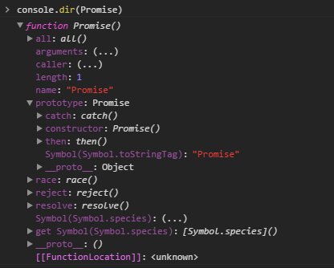
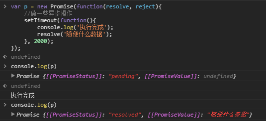

# Promise详解

- [Promise应用](#promise应用)
    - [Promise基础应用](#promise基础应用)
    - [链式调用](#链式调用)
    - [执行失败回调处理](#执行失败回调处理)
    - [catch的用法](#catch的用法)
    - [all的用法](#all的用法)
    - [race的用法](#race的用法)
    
- [Promise规范](#promise规范)
    - [Promise的状态](#promise的状态)
    - [Then方法](#then方法)
    - [Promise解决过程](#promise解决过程)
    
## Promise应用



`Promise`是一个构造函数，自己身上有`all`、`reject`、`resolve`这几个方法，原型上有`then`、`catch`等方法。

### Promise基础应用

`Promise`的构造函数接收一个参数，是函数，并且传入两个参数：`resolve`，`reject`，分别表示异步操作执行成功后的回调函数和异步操作执行失败后的回调函数。

这里用“成功”和“失败”来描述并不准确，按照标准来讲，`resolve`是将`Promise`的状态置为`fullfiled`，`reject`是将`Promise`的状态置为`rejected`。

```javascript
var p = new Promise(function(resolve, reject){
    //做一些异步操作
    setTimeout(function(){
        console.log('执行完成');
        resolve('随便什么数据');
    }, 2000);
});
```

运行结果



可以看到`Promise`的状态改变过程。

注意：

>只是`new`了一个对象，并没有调用它，我们传进去的函数就已经执行了。

所以我们用`Promise`的时候一般是包在一个函数中，在需要的时候去运行这个函数，如：

```javascript
function runAsync(){
    return new Promise(function(resolve, reject){
        //做一些异步操作
        setTimeout(function(){
            console.log('执行完成');
            resolve('随便什么数据');
        }, 2000);
    });      
}
runAsync()
```

在我们包装好的函数最后，会`return`出`Promise`对象，也就是说，执行这个函数我们得到了一个`Promise`对象。

而`Promise`对象上有`then`和`catch`方法。

```javascript
runAsync().then(function(data){
    console.log(data);
    // 可以用传过来的数据data进行其他操作
});
```
在`runAsync()`的返回上直接调用`then`方法，`then`接收一个参数，是函数，并且会拿到我们在`runAsync`中调用`resolve`时传的的参数。运行这段代码，会在2秒后输出“执行完成”，紧接着输出“随便什么数据”。

原来`then`里面的函数就跟我们平时的回调函数一个意思，能够在runAsync这个异步任务执行完成之后被执行。这就是Promise的作用了，简单来讲，就是能把原来的回调写法分离出来，在异步操作执行完后，用链式调用的方式执行回调函数。

若要实现同样的效果：

```javascript
function runAsync(callback){
    setTimeout(function(){
        console.log('执行完成');
        callback('随便什么数据');
    }, 2000);
}

runAsync(function(data){
    console.log(data);
});
```

### 链式调用

从表面上看，`Promise`只是能够简化层层回调的写法，而实质上，`Promise`的精髓是“状态”，用维护状态、传递状态的方式来使得回调函数能够及时调用，它比传递callback函数要简单、灵活的多。所以使用`Promise`的正确场景是这样的：

```javascript
function runAsync1(){
    return new Promise(function(resolve, reject){
        //做一些异步操作
        setTimeout(function(){
            console.log('异步任务1执行完成');
            resolve('随便什么数据1');
        }, 1000);
    });
}
function runAsync2(){
    return new Promise(function(resolve, reject){
        //做一些异步操作
        setTimeout(function(){
            console.log('异步任务2执行完成');
            resolve('随便什么数据2');
        }, 2000);
    });          
}
function runAsync3(){
    return new Promise(function(resolve, reject){
        //做一些异步操作
        setTimeout(function(){
            console.log('异步任务3执行完成');
            resolve('随便什么数据3');
        }, 3000);
    });            
}

// 调用
runAsync1()
.then(function(data){
    console.log(data);
    return runAsync2();
})
.then(function(data){
    console.log(data);
    return runAsync3();
})
.then(function(data){
    console.log(data);
});

// 结果
异步任务1执行完成
随便什么数据1
异步任务2执行完成
随便什么数据2
异步任务3执行完成
随便什么数据3
```

[为什么可以链式调用](#x-为promise)

在then方法中，你也可以直接`return`数据而不是`Promise`对象，在后面的then中就可以接收到数据了，比如我们把上面的代码修改成这样：

```javascript
runAsync1()
.then(function(data){
    console.log(data);
    return runAsync2();
})
.then(function(data){
    console.log(data);
    return '直接返回数据';  //这里直接返回数据
})
.then(function(data){
    console.log(data);
});

// 执行结果
异步任务1执行完成
随便什么数据1
异步任务2执行完成
随便什么数据2
直接返回数据
```

[这里是为什么？](#x-为对象或函数)

### 执行失败回调处理

```javascript
function getNumber(){
    return new Promise(function(resolve, reject){
        //做一些异步操作
        setTimeout(function(){
            var num = Math.ceil(Math.random()*10); //生成1-10的随机数
            if(num<=5){
                resolve(num);
            } else {
                reject('数字太大了');
            }
        }, 2000);
    });
}
getNumber()
.then(
    function(data) {
        console.log('resolved');
        console.log(data);
    },
    function(reason) {
        console.log('rejected');
        console.log(reason);
    }
);

// 执行结果有两种
// 1. resolved 3  
// 2. rejected 数字太大了
```

### catch的用法

```javascript
getNumber()
.then(function(data){
    console.log('resolved');
    console.log(data);
})
.catch(function(reason){
    console.log('rejected');
    console.log(reason);
});
```

1. 效果和写在then的第二个参数里面一样。
2. 另外一个作用：在执行`resolve`的回调（也就是上面`then`中的第一个参数）时，如果抛出异常了（代码出错了），那么并不会报错卡死js，而是会进到这个`catch`方法中。

```javascript
getNumber()
.then(function(data){
    console.log('resolved');
    console.log(data);
    console.log(somedata); //此处的somedata未定义
})
.catch(function(reason){
    console.log('rejected');
    console.log(reason);
});

// 结果
resolved
3
rejected
ReferenceError: somedata is not defined
```

错误原因传到了`reason`参数中。即便是有错误的代码也不会报错了，这与我们的`try/catch`语句有相同的功能。

### all的用法

`Promise`的`all`方法提供了并行执行异步操作的能力，并且在所有异步操作执行完后才执行回调。

```javascript
Promise
.all([runAsync1(), runAsync2(), runAsync3()])
.then(function(results){
    console.log(results);
});

// 输出
异步任务1执行完成
异步任务2执行完成
异步任务3执行完成
["随便什么数据1", "随便什么数据2", "随便什么数据3"]
```

应用场景：

页面加载过程中，c要依赖a、b等加载完成。

### race的用法

`all`方法的效果实际上是「谁跑的慢，以谁为准执行回调」，那么相对的就有另一个方法「谁跑的快，以谁为准执行回调」，这就是race方法，这个词本来就是赛跑的意思。

```javascript
Promise
.race([runAsync1(), runAsync2(), runAsync3()])
.then(function(results){
    console.log(results);
});

// 输出
异步任务1执行完成
随便什么数据1
异步任务2执行完成
异步任务3执行完成
```

注意：

在then里面的回调开始执行时，runAsync2()和runAsync3()并没有停止，仍旧再执行。于是再过1秒后，输出了他们结束的标志。

## Promise规范

### Promise的状态

一个`Promise`的当前状态必须为以下三种状态中的一种：**等待态（Pending）**、**执行态（Fulfilled）**和**拒绝态（Rejected）**。

#### 等待态（Pending）

处于等待态时，`promise`需满足以下条件：

- 可以迁移至执行态或拒绝态

#### 执行态（Fulfilled）

处于执行态时，`promise`需满足以下条件：

- 不能迁移至其他任何状态
- 必须拥有一个不可变的终值

#### 拒绝态（Rejected）

处于拒绝态时，`promise`需满足以下条件：

- 不能迁移至其他任何状态
- 必须拥有一个确定的据因（表示一个`promise`的拒绝原因）

### Then方法

一个`promise`必须提供一个`then`方法以访问其当前值、终值和据因。

`promise` 的 `then` 方法接受两个参数：

    promise.then(onFulfilled, onRejected)

#### 参数可选
     
`onFulfilled` 和 `onRejected` 都是可选参数。
     
- 如果 `onFulfilled` 不是函数，其必须被忽略
- 如果 `onRejected` 不是函数，其必须被忽略

#### `onFulfilled` 特性
     
如果 onFulfilled 是函数：
     
- 当 promise 执行结束后其必须被调用，其第一个参数为 `promise` 的终值
- 在 promise 执行结束前其不可被调用
- 其调用次数不可超过一次

#### `onRejected` 特性
     
如果 onRejected 是函数：
     
- 当 promise 被拒绝执行后其必须被调用，其第一个参数为 `promise` 的据因
- 在 promise 被拒绝执行前其不可被调用
- 其调用次数不可超过一次
     
#### 调用时机
     
`onFulfilled` 和 `onRejected` 只有在执行环境堆栈仅包含平台代码时才可被调用

#### 调用要求

`onFulfilled` 和 `onRejected` 必须被作为函数调用（即没有 `this` 值）

#### 多次调用

`then` 方法可以被同一个 `promise` 调用多次

当 `promise` 成功执行时，所有 `onFulfilled` 需按照其注册顺序依次回调
当 `promise` 被拒绝执行时，所有的 `onRejected` 需按照其注册顺序依次回调

#### 返回

`then` 方法必须返回一个 `promise` 对象

    promise2 = promise1.then(onFulfilled, onRejected);
    
- 如果 `onFulfilled` 或者 `onRejected` 返回一个值 `x` ，则运行下面的 `Promise` 解决过程：`[[Resolve]](promise2, x)`
- 如果 `onFulfilled` 或者 `onRejected` 抛出一个异常 `e` ，则 `promise2` 必须拒绝执行，并返回拒因 `e`
- 如果 `onFulfilled` 不是函数且 `promise1` 成功执行， `promise2` 必须成功执行并返回相同的值
- 如果 `onRejected` 不是函数且 `promise1` 拒绝执行， `promise2` 必须拒绝执行并返回相同的据因

注：
> 不论 `promise1` 被 `reject` 还是被 `resolve` 时 `promise2` 都会被 `resolve`，只有出现异常时才会被 `rejected`。

### Promise解决过程

`Promise` 解决过程 是一个抽象的操作，其需输入一个 `promise` 和一个值，我们表示为 `[[Resolve]](promise, x)`，如果 `x` 有 `then` 方法且看上去像一个 `Promise` ，解决程序即尝试使 `promise` 接受 `x` 的状态；否则其用 `x` 的值来执行 `promise`。

这种 `thenable` 的特性使得 `Promise` 的实现更具有通用性：只要其暴露出一个遵循 `Promise/A+` 协议的 `then` 方法即可；这同时也使遵循 `Promise/A+` 规范的实现可以与那些不太规范但可用的实现能良好共存。

运行 `[[Resolve]](promise, x)` 需遵循以下步骤：

#### `x` 与 `promise` 相等

- 如果 `promise` 和 `x` 指向同一对象，以 TypeError 为据因拒绝执行 `promise`

#### `x` 为 `Promise`

如果 `x` 为 `Promise` ，则使 `promise` 接受 `x` 的状态 注4：

- 如果 `x` 处于等待态， `promise` 需保持为等待态直至 `x` 被执行或拒绝
- 如果 `x` 处于执行态，用相同的值执行 `promise`
- 如果 `x` 处于拒绝态，用相同的据因拒绝 `promise`

#### `x` 为对象或函数

如果 `x` 为对象或者函数：

- 把 `x.then` 赋值给 `then`
- 如果取 `x.then` 的值时抛出错误 `e` ，则以 `e` 为据因拒绝 `promise`
- 如果 `then` 是函数，将 `x` 作为函数的作用域 `this` 调用之。传递两个回调函数作为参数，第一个参数叫做 resolve`Promise` ，第二个参数叫做 `rejectPromise`:
    - 如果 `resolvePromise` 以值 `y` 为参数被调用，则运行 `[[Resolve]](promise, y)`
    - 如果 `rejectPromise` 以据因 `r` 为参数被调用，则以据因 `r` 拒绝 `promise`
    - 如果 `resolvePromise` 和 `rejectPromise` 均被调用，或者被同一参数调用了多次，则优先采用首次调用并忽略剩下的调用
    - 如果调用 `then` 方法抛出了异常 `e`：
        - 如果 `resolvePromise` 或 `rejectPromise` 已经被调用，则忽略之
        - 否则以 `e` 为据因拒绝 `promise`
    - 如果 `then` 不是函数，以 `x` 为参数执行 `promise`
- 如果 `x` 不为对象或者函数，以 `x` 为参数执行 `promise`

如果一个 `promise` 被一个循环的 `thenable` 链中的对象解决，而 `[[Resolve]](promise, thenable)` 的递归性质又使得其被再次调用，根据上述的算法将会陷入无限递归之中。算法虽不强制要求，但也鼓励施者检测这样的递归是否存在，若检测到存在则以一个可识别的 `TypeError` 为据因来拒绝 `promise`。

