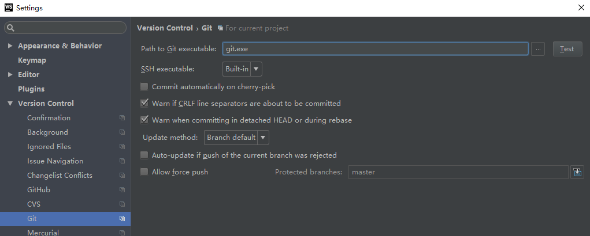

新下载的WebStorm，在使用GitHub或者Git时，报如下错：

解决方法（电脑已经安装GitHub）：

在`Path to Git executable`输入项中填入`GitHub`带的`Git.exe`，具体路径为：

    C:\Users\Cuiyan\AppData\Local\GitHub\PortableGit_f02737a78695063deace08e96d5042710d3e32db\cmd\git.exe

点击`Test`按钮，`Git executed successfully`，则配置`Git`成功！