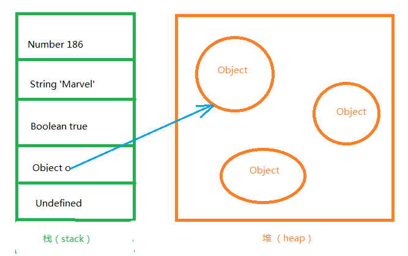
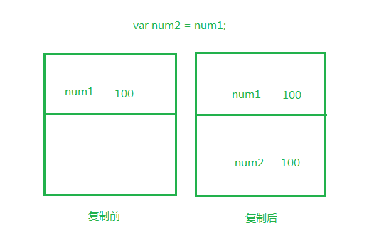
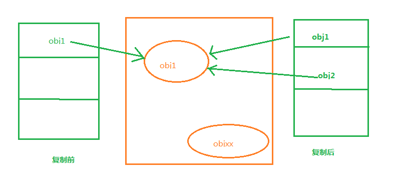
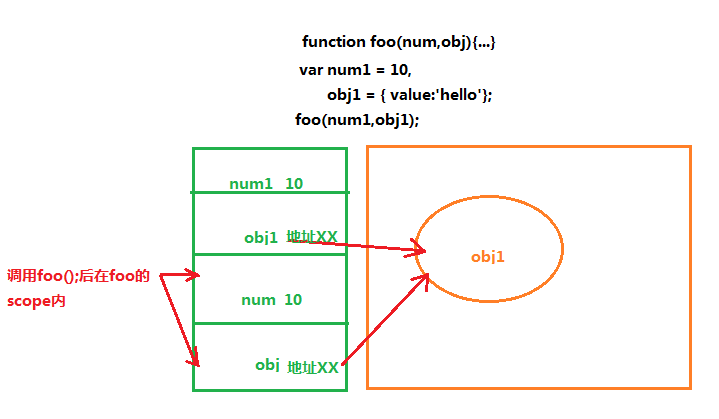

#js变量、作用域、内存
[TOC]

##js变量
在 ECMAScript 中，变量可以存在两种类型的值，即原始值和引用值。
###类型
####原始值
存储在栈（stack）中的简单数据段，也就是说，它们的值直接存储在变量访问的位置。
####引用值
存储在堆（heap）中的对象，也就是说，存储在变量处的值是一个指针（point），指向存储对象的内存处。

为变量赋值时，ECMAScript 的解释程序必须判断该值是原始类型，还是引用类型。要实现这一点，解释程序则需尝试判断该值是否为 ECMAScript 的原始类型之一，即 Undefined、Null、Boolean、Number 和 String 型。由于这些原始类型占据的空间是固定的，所以可将他们存储在较小的内存区域 - 栈中。这样存储便于迅速查寻变量的值。

如果一个值是引用类型的，那么它的存储空间将从堆中分配。由于引用值的大小会改变，所以不能把它放在栈中，否则会降低变量查寻的速度。相反，放在变量的栈空间中的值是该对象存储在堆中的地址。地址的大小是固定的，所以把它存储在栈中对变量性能无任何负面影响。如下图所示：

###typeof 运算符
	alert (typeof sTemp); 
对变量或值调用 typeof 运算符将返回下列值之一：
- undefined - 如果变量是 Undefined 类型的
- boolean - 如果变量是 Boolean 类型的
- number - 如果变量是 Number 类型的
- string - 如果变量是 String 类型的
- object - 如果变量是一种引用类型或 Null 类型的

**注释**：您也许会问，为什么 typeof 运算符对于 null 值会返回 "Object"。这实际上是 JavaScript 最初实现中的一个错误，然后被 ECMAScript 沿用了。现在，null 被认为是对象的占位符，从而解释了这一矛盾，但从技术上来说，它仍然是原始值。

---------------------------------------------
不同的内存分配机制也带来了不同的访问机制
在javascript中是不允许直接访问保存在堆内存中的对象的，所以在访问一个对象时，首先得到的是这个对象在堆内存中的地址，然后再按照这个地址去获得这个对象中的值，这就是传说中的按引用访问。而原始类型的值则是可以直接访问到的。

###访问机制的不同
>部分内容引用自：
>作者：苏墨橘
>链接：http://www.zhihu.com/question/27114726/answer/35481766
>来源：知乎
>著作权归作者所有。商业转载请联系作者获得授权，非商业转载请注明出处。
####复制变量时的不同（赋值）
**原始值赋值：**
在将一个保存着原始值的变量复制给另一个变量时，会将原始值的副本赋值给新变量，此后这两个变量是完全独立的，他们只是拥有相同的value而已。

``` javascript
var man = "Stone"; 
var man2 = man; 
//两个是Stone
console.log(man);
console.log(man2);

man = "BigStone";
//man是BigStone，man2是Stone
console.log(man);
console.log(man2);
```
**引用值赋值：**
在将一个保存着对象内存地址的变量复制给另一个变量时，会把这个内存地址赋值给新变量，也就是说这两个变量都指向了堆内存中的同一个对象，他们中任何一个作出的改变都会反映在另一个身上。（这里要理解的一点就是，复制对象时并不会在堆内存中新生成一个一模一样的对象，只是多了一个保存指向这个对象指针的变量罢了）

``` javascript
//man指向了栈内存的空间地址
var man = new Object(); 
man.name = "Jack";
//man2获得了man的指向地址
var man2 = man; 
//两个是Jack
console.log(man.name);
console.log(man2.name);

man.name = "Stone";
//两个都是Stone
console.log(man);
console.log(man2);

man2.name = "BigStone";
//两个都是BigStone
console.log(man);
console.log(man2);
```
####参数传递的不同
>1. http://bosn.me/js/js-call-by-sharing/
>2. **ECMAScript中所有函数的参数都是`按值来传递`的**。但是为什么涉及到原始类型与引用类型的值时仍然有区别呢，还不就是因为内存分配时的差别。 （这里和复制变量时遵循的机制完全一样的嘛，你可以简单地理解为传递参数的时候，就是把实参复制给形参的过程）

**原始值：**
只是把变量里的值传递给参数，之后参数和这个变量互不影响。
**引用值：**
对象变量它里面的值是这个对象在堆内存中的内存地址，这一点你要时刻铭记在心！因此它传递的值也就是这个内存地址，这也就是为什么函数内部对这个参数的修改会体现在外部的原因了，因为它们都指向同一个对象呀。

所以，如果是按引用传递的话，是把第二格中的内容（也就是变量本身）整个传递进去（就不会有第四格的存在了）。但事实是变量把它里面的值传递（复制）给了参数，让这个参数也指向原对象。因此如果在函数内部给这个参数赋值另一个对象时，这个参数就会更改它的值为新对象的内存地址指向新的对象，但此时原来的变量仍然指向原来的对象，这时候他们是相互独立的；但如果这个参数是改变对象内部的属性的话，这个改变会体现在外部，因为他们共同指向的这个对象被修改了呀！

``` javascript
function test(name){
	name = "BigStone";
	return name;
}
var name = "Stone";
var name2 = test(name);
//name=Stone,name2=BigStone
console.log(name);
console.log(name2);
```

``` javascript
function test(obj){
	obj.name = "BigStone";
	return obj;
}
var name1 = new Object();
name1.name = "Stone";
var name2 = test(name1);
//name1和name2都变成了BigStone
console.log(name1);
console.log(name2);
```
##执行环境及作用域
执行环境是javascript中最为重要的概念之一，执行环境定义了变量或函数有权访问其他数据。
###作用域
变量没有在函数内声明或者声明的时候没有带var就是全局变量，拥有全局作用域，window对象的所有属性拥有全局作用域；在代码任何地方都可以访问，函数内部声明并且以var修饰的变量就是局部变量，只能在函数体内使用，函数的参数虽然没有使用var但仍然是局部变量。
###全局变量
全局执行环境是最外围的执行环境，在web浏览器中，全局执行环境是window对象，因此，所有的全局变量的函数都是作为window的属性和方法创建的。
``` javascript
var name = "Stone";           //定义全局变量
function setName(){
    return "Stone";
}
//全局变量，最外围，属于window属性
alert(window.name);
//全局函数，最外围，属于window方法
alert(window.setName());
```
当执行环境内的代码执行完毕后，该环境被销毁，保存其中的变量和函数也随之销毁，如果是全局环境，需所有程序执行完毕或网页完毕后才会销毁。
###去掉var的局部变量
去掉var变成了全局变量
``` javascript
var name = "Jack";
function setName(){
	//去掉var变成了全局变量
    name = "Stone";
}
setName();
alert(name);//弹出Stone
```
###传参，也是局部变量
``` javascript
var name = "Jack";
function setName(name){    //通过传参，也是局部变量
    alert(name);
}

setName("Stone");//弹出Stone
alert(name);//弹出Jack
```
###函数体内还包含函数，只有这个函数才可以访问内一层的函数
``` javascript
var name = "Jack";
function setName(){
	//setYear()方法的作用域在setName()内
    function setYear(){    
        return 21;
    }
}
alert(setYear());//无法访问，出错 
```
可以通过如下方法进行访问：
``` javascript
var name = "Jack";
function setName(){
	//setYear()方法的作用域在setName()内
    function setYear(){            
	    return 21;
    }
    return setYear();
}
alert(setName()); //弹出21
```
``` javascript
var name = "Jack";
function setName(){
	//setYear()方法的作用域在setName()内
    function setYear(){    
	    //变量b的作用域在setYear()内
        var b = "hi";     
        return 21;
    }
    alert(b);//无法访问 
}
```
当代码在一个环境中执行的时候，就会形成一种叫做`作用域链`的东西，它的用途是保证对执行环境中有访问权限的变量和函数进行有序访问（指按照规则层次来访问），作用域链的前端，就是执行环境的变量对象。
###没有块级作用域
``` javascript
 //if语句的花括号没有作用域的功能。
if(true){                       
	var name = "Stone";
}
alert(name);//弹出 Stone
```
for循环语句也是如此。
###变量的查询
在变量的查询中，访问局部变量要比全局变量来得快。
``` javascript
var name = "Jack";
function setName(){
	var name = "Stone";
	return name;  //从底层向上搜索变量
}
alert(setName()); //弹出Stone
```
每个环境都可以向上搜索作用域链，以查询变量和函数名；但任何环境都不能通过向下搜索作用域链而进入另一个执行环境。
##内存问题
javascript具有自动垃圾回收机制，一旦数据不再使用，可以将其设为`"null"`来释放引用
###循环引用
一个很简单的例子：一个DOM对象被一个Javascript对象引用，与此同时又引用同一个或其它的Javascript对象，这个DOM对象可能会引发内存泄露。这个DOM对象的引用将不会在脚本停止的时候被垃圾回收器回收。要想破坏循环引用，引用DOM元素的对象或DOM对象的引用需要被赋值为null。
###闭包
在闭包中引入闭包外部的变量时，当闭包结束时此对象无法被垃圾回收（GC）。
``` javascript
var a = function() {
	var largeStr = new Array(1000000).join('x');
	return function() {
		return largeStr;
	}
}();
```
###DOM泄露
当原有的COM被移除时，子结点引用没有被移除则无法回收。
``` javascript
var select = document.querySelector;
var treeRef = select('#tree');

//在COM树中leafRef是treeFre的一个子结点
var leafRef = select('#leaf'); 
var body = select('body');

body.removeChild(treeRef);

//#tree不能被回收入，因为treeRef还在
//解决方法:
treeRef = null;

//tree还不能被回收，因为叶子结果leafRef还在
leafRef = null;

//现在#tree可以被释放了
```
###Timers计（定）时器泄露
``` javascript
for (var i = 0; i < 90000; i++) {
	var buggyObject = {
		callAgain: function() {
			var ref = this;
			var val = setTimeout(function() {
			ref.callAgain();
		}, 90000);
	}
}

buggyObject.callAgain();
//虽然你想回收但是timer还在
buggyObject = null;
}
```
###调试内存
Chrome自带的内存调试工具可以很方便地查看内存使用情况和内存泄露：
在 Timeline -> Memory 点击record即可。