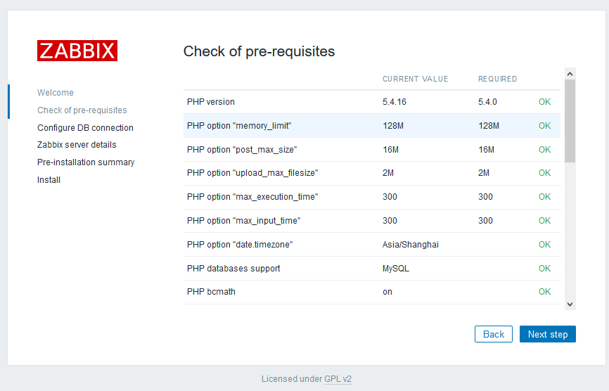

# zabbix安装说明

- [基本说明](#基本说明)
- [Server安装](#server安装)
- [Client安装](#client安装)
- [](#)
- [](#)
- [](#)
- [](#)

## 基本说明

### 安装环境

- 系统环境：Centos7.2
- 数据库：MySQL（PostgreSQL）
- Zabbix版本：3.2

### 官方文档地址

[zabbix安装说明](https://www.zabbix.com/documentation/3.2/manual/installation/install_from_packages)

## Server安装

使用Yum安装。

1. 导入源

    `# rpm -ivh http://repo.zabbix.com/zabbix/3.2/rhel/7/x86_64/zabbix-release-3.2-1.el7.noarch.rpm`

2. 安装zabbix包

    `yum install zabbix-server-mysql zabbix-web-mysql`
    
3. 安装MySQL数据库

    CentOS 7的yum源中没有正常安装mysql时的mysql-sever文件，需要去官网上下载。
    
    ```text
    # wget http://dev.mysql.com/get/mysql-community-release-el7-5.noarch.rpm
    # rpm -ivh mysql-community-release-el7-5.noarch.rpm
    # yum install mysql-community-server
    ```
    
    成功安装之后重启mysql服务。
    
    ```text
    # service mysqld restart
    ```
    
    初次安装mysql是root账户是没有密码的。
    设置密码的方法
    
    ```text
    # mysql –u root
    mysql> set password for ‘root’@‘localhost’ = password(‘mypasswd’);
    mysql> exit
    ```
    
    设置开机启动
    
    ```text
    # systemctl enable mysqld
    ```
    
4. 新建数据库

    ```text
    shell> mysql -uroot -p<root_password>
    mysql> create database zabbix character set utf8 collate utf8_bin;
    mysql> grant all privileges on zabbix.* to zabbix@localhost identified by '<password>';
    mysql> quit;
    ```
    
5. 导入数据库表

    ```text
    # zcat /usr/share/doc/zabbix-server-mysql-3.2.*/create.sql.gz | mysql -uzabbix -p zabbix
    ```

6. 修改zabbixserver配置文件
    
    ```text
    # vi /etc/zabbix/zabbix_server.conf
    DBHost=localhost
    DBName=zabbix
    DBUser=zabbix
    DBPassword=zabbix
    实际上是DBHost和DBPassword去掉前面的#号即可。
    ```
    
7. 启动zabbix服务
    
    ```text
    # systemctl start zabbix-server
    设置开机自动启动
    # systemctl enable zabbix-server
    ```
    
8. 修改PHP设置

    ```text
    # vim /etc/httpd/conf.d/zabbix.conf
    php_value max_execution_time 300
    php_value memory_limit 128M
    php_value post_max_size 16M
    php_value upload_max_filesize 2M
    php_value max_input_time 300
    php_value always_populate_raw_post_data -1
    php_value date.timezone Asia/Shanghai
    实际上就是修改时区。
    ```
9. 启动apache服务

    ```text
    # systemctl start httpd
    设置开机自动启动
    # systemctl enable httpd
    ```
10. 登录zabbix

    ```text
    http://IP/zabbix/
    ```
    
    1. 首次登录需进行验证与配置
    
        
    
    2. 点击next会出现检查状态
    
        
    
    3. 点击next配置MySQL
    
        
    
    4. 继续
    
        
    
        
    
        
    
    5. 默认用户名密码为`Admin/zabbix`
    
        
    
## Windows Agent安装

1. 下载客户端

    `http://www.zabbix.com/download`

2. 目录结构

    ```text
    zabbix_agents_3.2.0.win
    ├── bin
    |   ├── win32
    |   |   ├── zabbix_agentd.exe
    |   |   ├── zabbix_get.exe
    |   |   └── zabbix_sender.exe
    |   └── win64
    |   |   ├── zabbix_agentd.exe
    |   |   ├── zabbix_get.exe
    |   |   └── zabbix_sender.exe
    └── conf
        └── zabbix_agentd.win.conf
    ```

3. 修改或新增配置文件

    1. 修改zabbix_agents_3.2.0.win\conf\zabbix_agentd.win.conf
    
        ```text
        //括号内是行号
        (23)LogFile=D:\zabbix_agentd.log// 日志文件路径
        (84)Server=127.0.0.1// 服务端ip（可多个，用“,”隔开）
        (125)ServerActive=127.0.0.1// 服务端ip
        (136)Hostname=Windows host	// 客户端Name（要与监控页面hosts配置的Hostname一致）
        ```
    2. 新建zabbix_agentd.win.conf文件
    
        写入上述内容即可。

4. 安装与启动

    进入zabbix_agentd.exe文件目录下，执行如下命令完成安装
    
    ```text
    zabbix_agentd.exe -c c:\zabbix\zabbix_agentd.conf -i
    ```
    
    执行如下命令，启动客户端服务
    
    ```text
    zabbix_agentd.exe -c c:\zabbix\zabbix_agentd.conf -s
    ```

## CentOS Agent安装

1. 导入源

    ```text
    # rpm -ivh http://repo.zabbix.com/zabbix/3.2/rhel/7/x86_64/zabbix-release-3.2-1.el7.noarch.rpm
    ```
    
2. 安装

    ```text
    # yum install zabbix-agent
    ```
    
3. 修改配置文件

    ```text
    # vi /etc/zabbix/zabbix_agentd.conf
    修改如下几项：
    LogFile=D:\zabbix_agentd.log// 日志文件路径
    Server=127.0.0.1// 服务端ip（可多个，用“,”隔开）
    ServerActive=127.0.0.1// 服务端ip
    Hostname=Windows host	// 客户端Name（要与监控页面hosts配置的Hostname一致）
    ```
    
4. 启动

    `# systemctl start zabbix-agent`