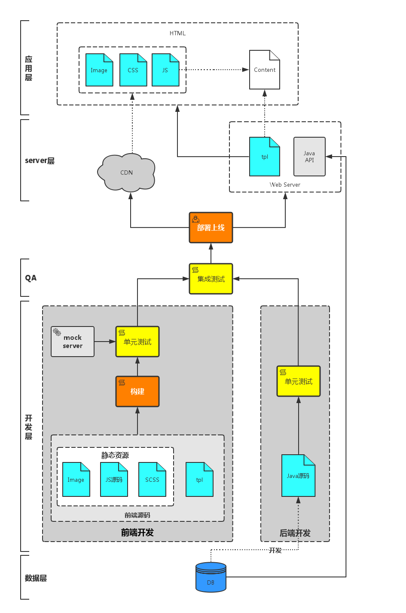

# 前端开发工程化

[前端开发工程化探讨--基础篇（长文）](https://blog.coding.net/blog/frontend-engineering)

- 第一阶段：库/框架选型
- 第二阶段：简单构建优化
- 第三阶段：JS/CSS模块化开发
- 第四阶段：组件化开发与资源管理

[浅析前端工程化](http://www.cnblogs.com/ihardcoder/p/5378290.html)

## 前端工程化面临的问题

要解决前端工程化的问题，可以从两个角度入手：开发和部署。

从开发角度，要解决的问题包括：

- 提高开发生产效率；
- 降低维护难度。

这两个问题的解决方案有两点：

- 制定开发规范，提高团队协作能力；
- 模块化开发。其中心思想是**分治**。

从部署角度，要解决的问题主要是资源管理，包括：

- 代码审查；
- 压缩打包；
- 增量更新；
- 单元测试；

要解决上述问题，需要引入构建/编译工具。

## 解决问题

### 开发规范

开发规范的目的是统一团队成员的编码规范，便于团队协作和代码维护。开发规范没有统一的标准，每个团队可以建立自己的一套规范体系。

值得一提的是JavaScript的开发规范，尤其是在ES2015越来越普及的局面下，保持良好的编码风格是非常必要的。

### 模块/组件开发

#### 模块还是组件？

组件（component）和模块（module）应该是两个不同的概念。两者的区别主要在颗粒度方面。

`module`侧重的是对属性的封装，重心是在设计和开发阶段，不关注`runtime`的逻辑。`module`是一个白盒；而`component`是一个可以独立部署的软件单元，面向的是`runtime`，侧重于产品的功能性。`component`是一个黑盒，内部的逻辑是不可见的。

#### 模块开发思想

[CommonJS、RequireJS(AMD)、SeaJS(CMD)解析](CommonJS、RequireJS(AMD)、SeaJS(CMD)解析.md)

### 构建&编译

一个典型的web前后端协作模式。

构建的核心是资源管理！

预编译方面

- es6/7转译，比如babel；
- 将less/sass编译成css；
- spirit图片生成；

性能因素方面

- 依赖打包。分析文件依赖关系，将同步依赖的的文件打包在一起，减少http请求数量；
- 资源嵌入。比如小于10KB的图片编译为base64格式嵌入文档，减少一次http请求；
- 文件压缩。减小文件体积；
- hash指纹。通过给文件名加入hash指纹，以应对浏览器缓存引起的静态资源更新问题；
- 代码审查。避免上线文件的低级错误；

提高开发阶段的生产效率

- 文件监听。配合动态构建、浏览器自动刷新等功能，提高开发效率；
- mock server。并非所有前端团队都是大前端（事实上很少团队是大前端），即使在大前端体系下，mock server的存在也是很有必要的；

模板构建

- url改变。开发环境与线上环境的url肯定是不同的，不同类型的资源甚至根据项目的CDN策略放在不同的服务器上；
- 文件名改变。静态资源经过构建之后，文件名被加上hash指纹，内容的改动导致hash指纹的改变。