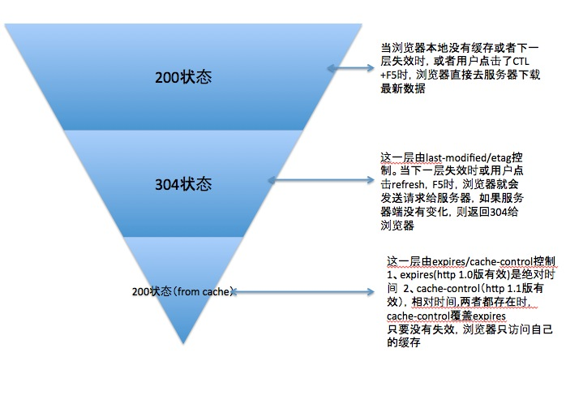

# 浏览器缓存策略

- [总览](#总览)
- [LastModified](#lastmodified)
- [Etag](#etag)
- [LastModified和Etag](#lastmodified和etag)
- [CacheControl和Expire](#cachecontrol和expire)

>部分内容引用自http://blog.csdn.net/eroswang/article/details/8302191

## 总览

## LastModified

在浏览器第一次请求某一个URL时，服务器端的返回状态会是200，内容是你请求的资源，同时有一个`Last-Modified`的属性(Reponse Header属性)标记此文件在服务期端最后被修改的时间，格式类似这样：

    Last-Modified:Tue, 24 Feb 2009 08:01:04 GMT
    
客户端第二次请求此URL时，根据HTTP协议的规定，浏览器会向服务器传送`If-Modified-Since`报头(Request Header)，询问该时间之后文件是否有被修改过：

    If-Modified-Since:Tue, 24 Feb 2009 08:01:04 GMT
    
如果服务器端的资源没有变化，则自动返回HTTP304（NotChanged）状态码，内容为空，这样就节省了传输数据量。当服务器端代码发生改变或者重启服务器时，则重新发出资源，返回和第一次请求时类似。从而保证不向客户端重复发出资源，也保证当服务器有变化时，客户端能够得到最新的资源。

注：如果`If-Modified-Since`的时间比服务器当前时间(当前的请求时间request_time)还晚，会认为是个非法请求

## Etag

HTTP协议规格说明定义ETag为“被请求变量的实体标记”。简单点即服务器响应时给请求URL标记，并在HTTP响应头中将其传送到客户端，类似服务器端返回的格式：

    Etag:"5d8c72a5edda8d6a:3239"
    
客户端的查询更新格式是这样的：

    If-None-Match:"5d8c72a5edda8d6a:3239"
    
如果ETag没改变，则返回状态304。

即:在客户端发出请求后，`HttpReponse Header`中包含`Etag:"5d8c72a5edda8d6a:3239"`标识，等于告诉Client端，你拿到的这个的资源有表示`ID：5d8c72a5edda8d6a:3239`。当下次需要发Request索要同一个URI的时候，浏览器同时发出一个`If-None-Match`报头(RequestHeader)，此时报头中信息包含上次访问得到的Etag标识`If-None-Match:"5d8c72a5edda8d6a:3239"`，这样，服务器端就会比对两者的Etag。如果两者一致，返回304。

## LastModified和Etag

应用流程

1. 客户端请求一个页面（A）。
2. 服务器返回页面A，并在给A加上一个`Last-Modified/ETag`。
3. 客户端展现该页面，并将页面连同`Last-Modified/ETag`一起缓存。
4. 客户再次请求页面A，并将上次请求时服务器返回的`Last-Modified/ETag`(分别作为`If-Modified-Since/If-None-Match`)一起传递给服务器。
5. 服务器检查该`Last-Modified`和`ETag`，并判断出该页面自上次客户端请求之后还未被修改，直接返回响应304和一个空的响应体。

注：

布式系统里多台机器间文件的`Last-Modified`必须保持一致，以免负载均衡到不同机器导致比对失败。分布式系统尽量关闭掉Etag(每台机器生成的etag都会不一样)

## CacheControl和Expire

Expires = 时间，HTTP 1.0 版本，缓存的载止时间，允许客户端在这个时间之前不去检查（发请求）。

Cache-Control: max-age = 秒，HTTP 1.1版本，资源在本地缓存多少秒。

如果`Cache-Control:max-age`和`Expires`同时存在，则`Expires`被`Cache-Control:max-age`覆盖。

Expires 的一个缺点就是，返回的到期时间是服务器端的时间，这样存在一个问题，如果客户端的时间与服务器的时间相差很大，那么误差就很大，所以在HTTP 1.1版开始，使用Cache-Control: max-age=秒替代。

Expires = max-age + 每次下载时的当前时间。所以一旦重新下载的页面后，expires就重新计算一次。