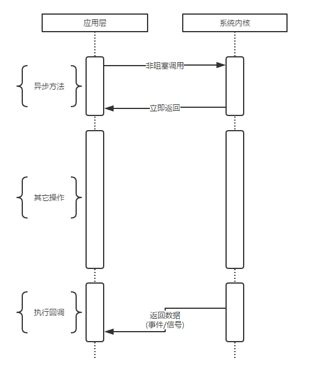

# 阻塞IO、非阻塞IO、异步IO

- [概念](#概念)
    - [阻塞IO](#阻塞io)
    - [非阻塞IO](#非阻塞io)
    - [异步IO](#异步io)
- [node中异步IO实现](#node中异步io实现)
- 
- 
- 

## 概念

以一个形象的例子引入概念。

周末我和女友去逛街，中午饿了，我们准备去吃饭。周末人多，吃饭需要排队，我和女友有以下几种方案：

### 阻塞IO模型

我和女友点完餐后，不知道什么时候能做好，只好坐在餐厅里面等，直到做好，然后吃完才离开。

女友本想还和我一起逛街的，但是不知道饭能什么时候做好，只好和我一起在餐厅等，而不能去逛街，直到吃完饭才能去逛街，中间等待做饭的时间浪费掉了。
这就是典型的阻塞。

阻塞IO如下图所示：

特点：

阻塞IO调用之后一定要等到内核层面完成所有操作之后，调用才能结束。

阻塞IO造成CPU等待IO，浪费等待时间，CPU的处理能力得不到充分利用。

### 非阻塞IO

我女友不甘心白白在这等，又想去逛商场，又担心饭好了。所以我们逛一会，回来询问服务员饭好了没有，来来回回好多次，饭都还没吃都快累死了啦。这就是非阻塞。
需要不断的询问，是否准备好了。

非阻塞IO如下图所示：

特点：

非阻塞IO调用后直接返回，CPU可以用来处理其它事务，性能提升明显。

但是，非阻塞IO调用返回时，完成的IO并没有完成，立即返回的不是业务层面期望的数据，而仅仅是当前调用状态；为了获取完整的数据，
应用程序需要重复调用IO操作来确认是否完成 -- 轮询 -- read轮询技术。

与第二个方案差不多，餐厅安装了电子屏幕用来显示点餐的状态，这样我和女友逛街一会，回来就不用去询问服务员了，直接看电子屏幕就可以了。
这样每个人的餐是否好了，都直接看电子屏幕就可以了，这就是典型的IO多路复用，如select、poll、epoll。

具体模型如下图所示：

特点：

轮询技术不断演进，以减少IO状态判断造成的CPU损耗。诞生了select、poll、epoll等轮询技术。

知道epoll方案，该方案是Linux下效率最高的IO事件通知机制，在进入轮询的时候，如果没有检查到IO事件，就会进入休眠状态，直到事件发生将它唤醒。
真实利用了事件通知+执行回调的方式，执行效率较高。

### 异步IO

餐厅部署了电话通知系统，我和女友点完餐以后放心地出去逛街，等电话通知到饭做好了，我们就逛完最后一家店铺，去吃饭。

异步IO模型如下图所示：

## node中异步IO实现

### 事件循环

每个事件循环中都有一个或多个观察者，而判断是否有事件要处理的过程就是向这些观察者询问是否有事件要处理的过程。

